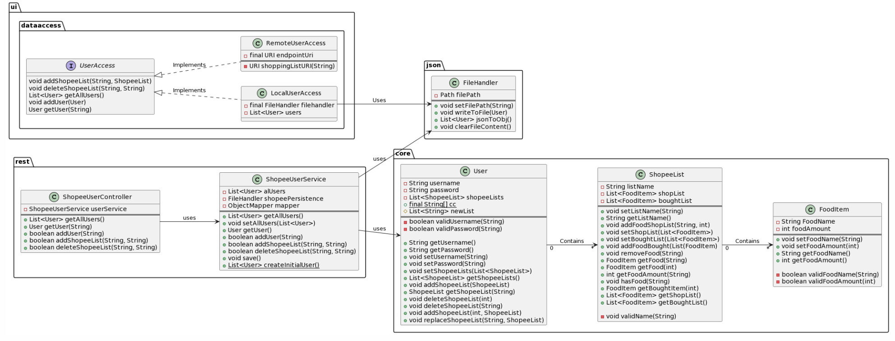

## Package Diagram
The package diagram for the project shows an overview of how the different components are grouped together and how they interact with eachother.

## Class Diagram
The class diagram provides a visual representation of the structure and relationships of most of the classes in the project. It delves more into detail than the package diagram, but, in return, it is not as readable nor clear.

The group prioritized readability over information when designing the diagram. Additionally, there was a focus on presenting a holistic view of how the classes interact with each other across the REST API and the core classes. Therefore, only the most important classes and dependencies are represented. While several classes import each other, the diagram does not depict imports. Instead, the places where a class directly utilizes another through the declaration of an instance are shown with an association arrow. As much of the functionality of the UI package is revealed through the sequence diagram, it has been chosen not to include anything other than the 'dataaccess' folder in this class diagram. The package diagram, to some extent, also provides an understanding of how the various packages interact with each other.

## Sequense Diagram

For the sequence diagram, the group chose to base it on user story number 3: when the user wants to create a new Shopee list. This is one of the essential functionalities of the application, providing a comprehensive insight into how the program operates from the user interface, through the controller classes, client, and server, and back to the user interface. The sequence diagram is relatively extensive, but the group deemed it appropriate to include everything executed through the user's keystrokes to paint a picture of how the application is structured.

----

__Together, these three diagrams__ provide a detailed description of how Shopee is structured and operates.