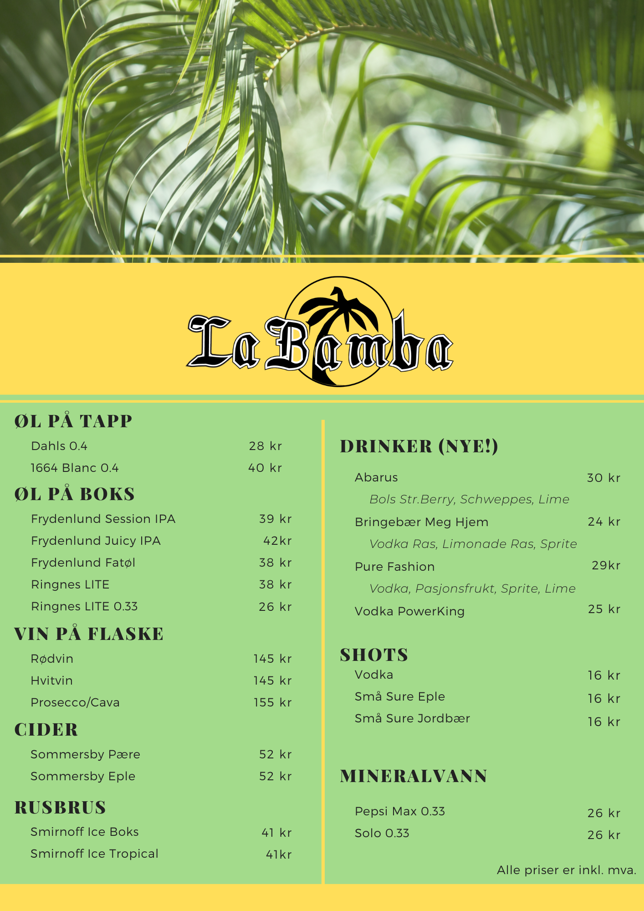

# **Release 1**

**Goal: Apply elementary domain logic and perform uncomplicated file handling.**

For the first release, the project consists of the following classes and resources:

### Core

* [ShopeeList.java](../core/src/main/java/core/ShopeeList.java)

### UI

* [Shopee.java](../core/ui/src/main/java/ui/Shopee.java): App Class
* [ShopeeController.java](../ui/src/main/java/ui/ShopeeController.java) Controller for the App

### JSON

* Filhåndtering, kanskje ikke bruke JSON???

**Resources:** 
* [Shopee.fxml](../ui/src/main/resources/ui/Shopee.fxml)

## In version 1 of the app, the following scenes will be included: 
### Bilde av interfacet

## User story for release 1 

* 