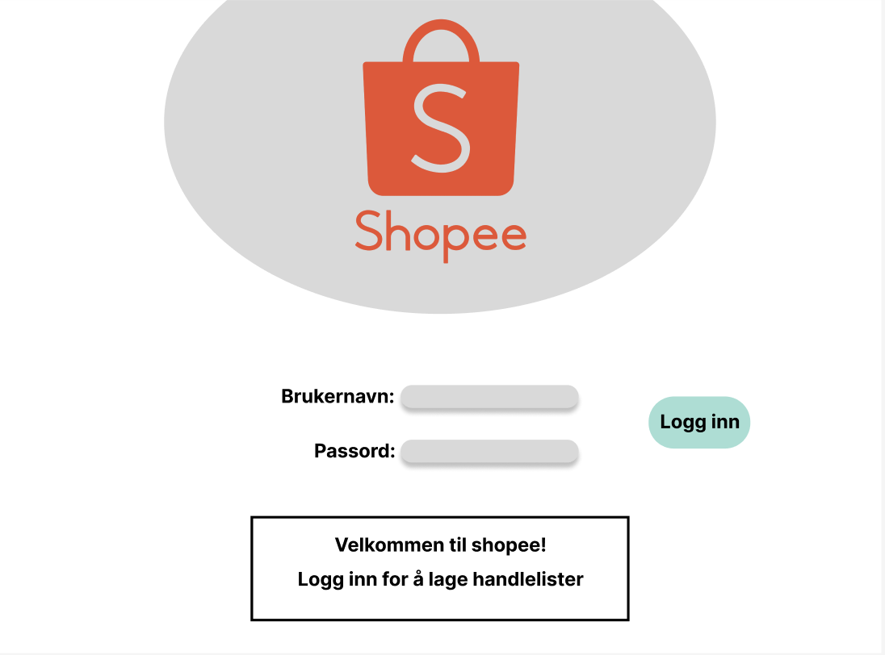
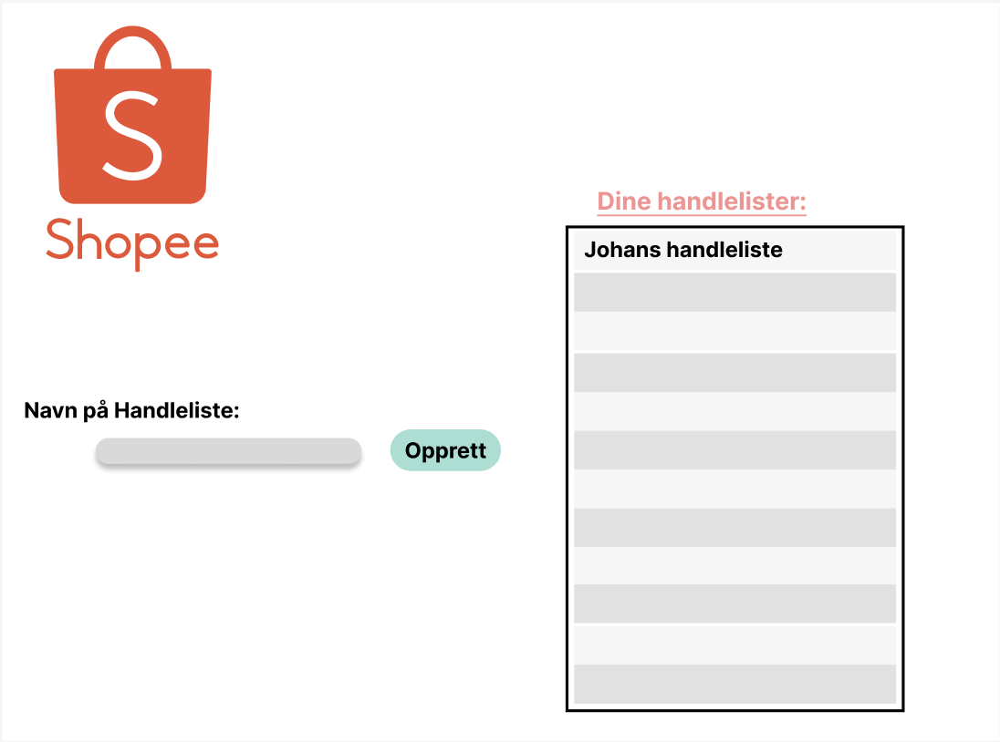
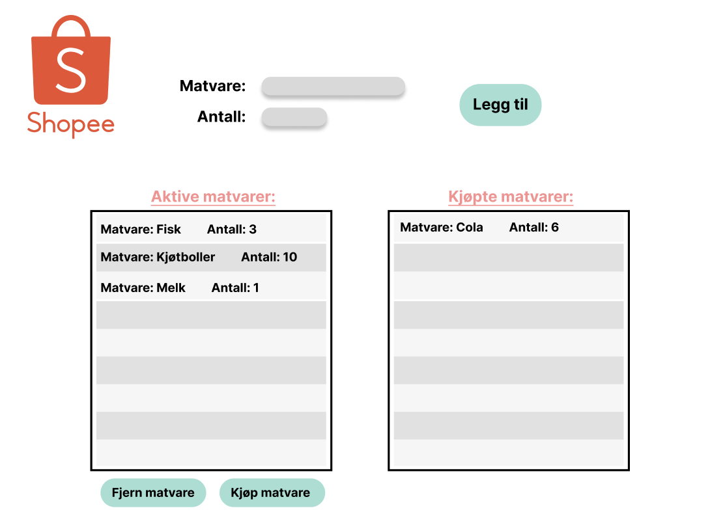

# Shopee Project

## App Description
The shopee app is an application that works as a shopping list. The app allows a user to create a shopping list and manage the shopping list. The shopee app makes it easy to keep track of what the user need to purchase by adding food items along with the amount of the item. 
___
## Illustrative screenshot of the application

The pictures illustrate how the group thinks the final product of the app will look like. 

### FrontPage:

### New Shopee List:

### Edit Shopee List:

## User story
As a user I want to be able to add food items to my shopping list, and also mark item as bought or remove items, for an efficient and simple shopping.
_____
### important to be able to see
1. **Shopping List** : The user should be able to see the food items added to the shopping list along with the amount of food items. Food items that is bought should not be shown in the list.

### important to be able to do
1. **Add food** : User should be able to use input field to add food item to shopping list
2. **Buy food** : User should be able to mark a food item in the list and then click button to mark as bought. 
3. **Remove food** : User should be able to mark a food item and click the button for removing the item. 

